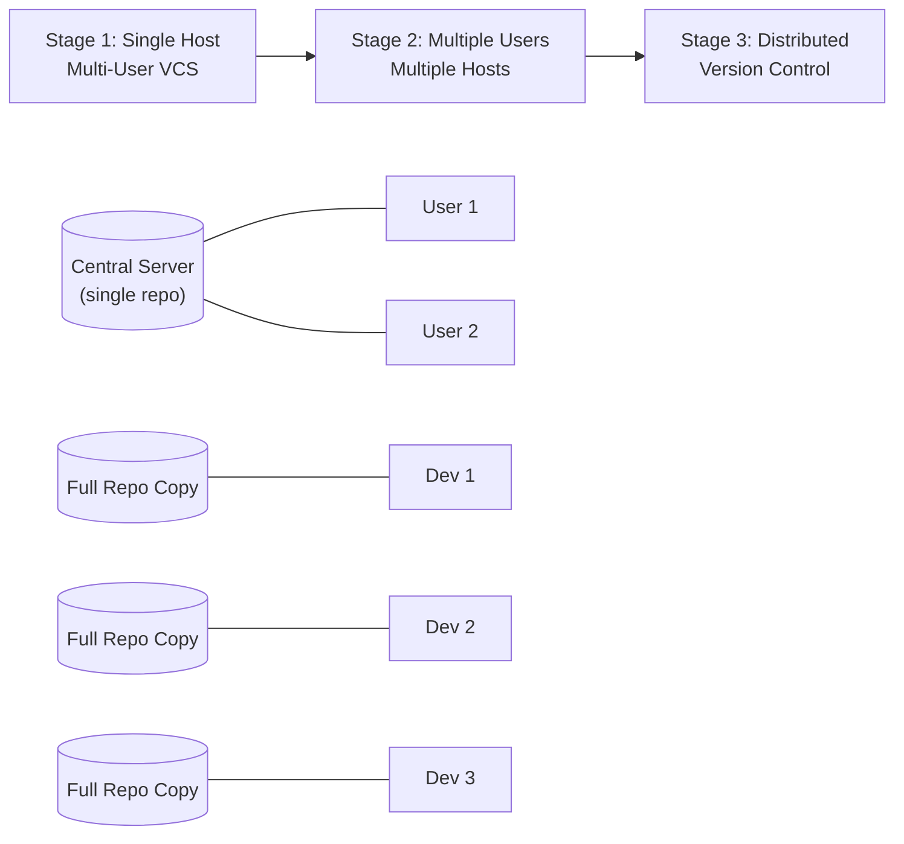

## 1. Why CI Starts with Version Control

Continuous Integration (CI) begins the moment a change is committed into a **Version Control System (VCS)**. Every CI pipeline — build, test, package, deploy — is triggered off an event in the repository (a push, a merge, a tag). Without a VCS as the system of record for code changes, there is no reliable trigger point and no audit trail for CI to build on.

```
Developer Change → Version Control System → CI Pipeline Trigger → Build/Test/Deploy
```

---

## 2. Core Terminology

| Term | Definition |
|---|---|
| **Repository** | A storage location for code that also retains *versions/revisions* — i.e., the full history of every change made. |
| **Changeset** | A set of changes spanning one or multiple files, grouped together to deliver a single feature or fix. |

---

## 3. Repository vs Storage

A key distinction taught in this session:

> **Organizations need Source Code *Repositories*, not Source Code *Storages*.**

A plain storage location (like a shared drive or a flat folder) only holds the *current* state of files. A repository is expected to additionally track:

- **Revisions / versions** — what changed, over time
- **Who** made the change (authorship/accountability)
- **Why** the change was made (commit messages, rationale)

This distinction is what separates simple file storage from a true version control system.

---

## 4. What a Version Control System Provides

A Version Control System is more than a repository — it is a complete collaboration platform for code:

- **Is a Source Code Repository** — retains full change history
- **User Management** — tracks identity of contributors, controls access
- **Parallel Development** — supports working on parallel versions or releases (branches)
- **Multi-User, Simultaneous Access** — many developers can work concurrently without overwriting each other's work

```
                ┌────────────────────────────────┐
                │   Version Control System       │
                │                                │
                │  • Source Code Repository      │
                │  • User Management             │
                │  • Parallel Versions/Releases  │
                │  • Multi-User Simultaneous     │
                │    Access                      │
                └────────────────────────────────┘
```

---

## 5. Popular Version Control Systems

| System | Notes |
|---|---|
| **Git** | Distributed VCS; industry standard today |
| **Subversion (SVN)** | Centralized VCS, widely used historically |
| **Perforce** | Centralized, strong in gaming/large binary asset workflows |
| **Mercurial** | Distributed VCS, similar goals to Git |
| **Clear Case** | Enterprise-grade VCS (IBM), used in regulated/legacy environments |

---

## 6. Evolution of Version Control

Version control systems evolved through distinct architectural generations:

### Stage 1 — Single Host, Multi-User VCS
One central server holds the repository; multiple users connect to that single host to check in/out code.

### Stage 2 — Multiple Users, Multiple Hosts
Architecture expands so that users and repository copies can exist across multiple hosts/servers (a step toward decentralization).

### Stage 3 — Distributed Version Control
Every user has a **full copy of the repository** (including complete history) on their own machine. This is the model Git follows.



> **Key takeaway:** Git is a popular **Distributed Version Control System (DVCS)** — every clone is a complete repository with full history, not just a working copy.

---

## 7. Git Hosting Models

Git repositories can be hosted in three broad ways:

### A. Self-Hosted
You run the Git server infrastructure yourself.

- **Gitolite** — lightweight, access-control-focused Git server management
- **Gerrit** — Git server with built-in code review workflow

### B. Git as a Service (SaaS)
Third-party platforms host Git for you, with added collaboration tooling (issues, PRs/MRs, CI integration, etc.).

- **GitHub**
- **GitLab**
- **BitBucket**

### C. Cloud Provider–Native Repos
Source repositories offered as part of a cloud platform's native service catalog.

- **Azure Source Repos** (Azure Repos)
- **AWS CodeCommit**

```
Git Hosting Models
│
├── Self-Hosted
│   ├── Gitolite
│   └── Gerrit
│
├── Git as a Service
│   ├── GitHub
│   ├── GitLab
│   └── BitBucket
│
└── Cloud Provider
    ├── Azure Source Repos
    └── AWS CodeCommit
```
