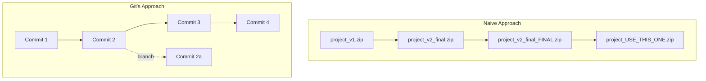
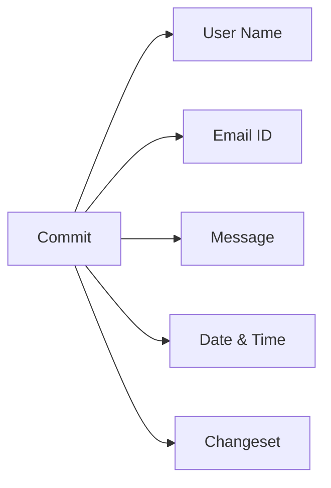
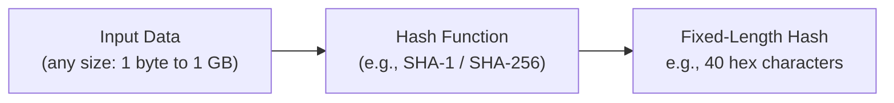
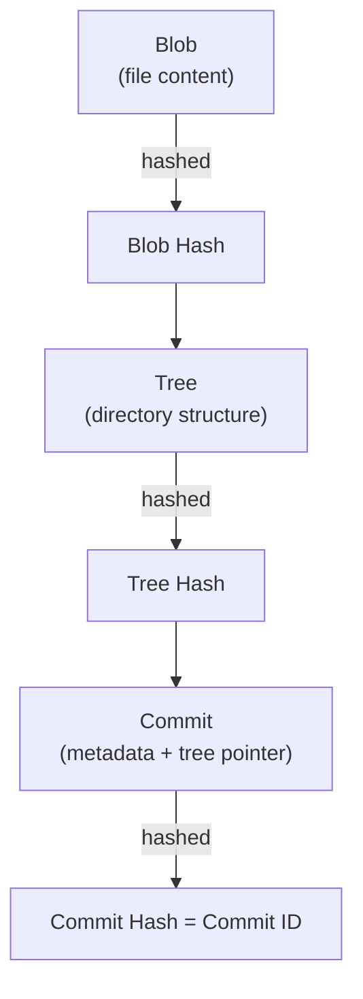

## 1. Session Objective

Understand **why version control systems like Git exist**, and get comfortable with the two foundational ideas every Git user must internalize before typing a single command:

- What information a **commit** captures
- What **hashing** is, and why Git relies on it instead of simple sequence numbers

---

## 2. Why Do We Need Git? — The Library Analogy

The class opened with a simple real-world scenario used to build intuition before touching any commands.

**Scenario:** You have a large, disorganized pile of books. Your job is to move them to a new location where they'll be displayed properly in a library.


This maps directly onto software development:

| Library Analogy | Software Development Equivalent |
|---|---|
| Pile of books | Your project's files as they evolve over time |
| Moving books to a shelf | Saving/organizing changes over time |
| Labeling shelves so books can be found | Commit messages & metadata so changes can be found |
| Multiple people organizing books at once | Multiple developers working on the same codebase |
| Knowing which book was placed when, by whom | Knowing which change was made when, by whom |

**Key takeaway:** Just as a library needs a cataloging system (not just a pile), a codebase needs a structured way to record *what changed, when, and by whom* — that system is Git.

---

## 3. The Naive Approach vs Git's Approach

Before Git-like tools existed, teams often tried simpler (and weaker) approaches:



| Naive Folder/Zip Approach | Git Approach |
|---|---|
| Manual copies with confusing names | Automatic, structured snapshots (commits) |
| No record of *who* changed *what* | Every commit tagged with author, email, timestamp |
| Hard to go back to a specific point | Any commit can be checked out instantly |
| No safe way to experiment | Branching allows isolated experiments |
| Merging changes is manual and error-prone | Git has built-in merge tooling |

This is exactly the gap Git was built to close — a systematic, verifiable way to track the "moving of books to the shelf" for code.

---

## 4. Anatomy of a Git Commit

Every commit in Git is not just "a saved file" — it is a labeled, traceable unit of change. To create a valid commit label, Git requires:

| # | Component | Description |
|---|---|---|
| 1 | **User name** | Identifies *who* made the change |
| 2 | **Email ID** | Ties the commit to a verifiable identity |
| 3 | **Message** | Human-readable explanation of *why* the change was made |
| 4 | **Date & time** | *When* the change was committed |
| 5 | **Changeset** | The actual diff/content — *what* changed |



**Teaching note:** Emphasize to students that a commit is a *complete record*, not just a file save. If any of these five pieces is missing or wrong, the commit's trustworthiness as a historical record breaks down (e.g., wrong email = misattributed change).

---

## 5. Commit IDs — Why Not Sequential Numbers?

A key point raised in class:

> Every commit gets a **unique ID** — but it is *not* a simple sequence number (1, 2, 3, ...).

**Why this matters:**

| Sequential Numbering | Git's Hash-Based ID |
|---|---|
| Works only if there's one central authority assigning numbers | Works in a fully distributed system (no central authority needed) |
| Two developers working offline could create colliding IDs | Two developers can independently create commits with virtually zero chance of ID collision |
| Doesn't verify content integrity | ID is derived *from* the content — any change in content changes the ID |
| Simple to predict | Tamper-evident: altering history changes all downstream IDs |

This directly motivates the next concept the class was asked to research: **hashing**.

---

## 6. Understanding Hashing (Core Concept)

The class was given a self-study prompt: *"Find out what hashing is."* Here's the reference explanation to use in the next session.

### What is Hashing?

**Hashing** is the process of running data (of any size) through a mathematical function (a **hash function**) that produces a **fixed-length string of characters**, called a **hash** or **digest**.



### Core Properties of a Good Hash Function

| Property | Meaning |
|---|---|
| **Deterministic** | Same input always produces the same hash |
| **Fixed-length output** | Output size doesn't depend on input size |
| **Fast to compute** | Efficient even for large inputs |
| **Avalanche effect** | A tiny change in input drastically changes the output hash |
| **One-way (irreversible)** | You cannot reconstruct the original input from the hash |
| **Collision-resistant** | Extremely unlikely for two different inputs to produce the same hash |

### Simple Illustration

| Input | Hash Output (illustrative, not real SHA-1) |
|---|---|
| `"hello"` | `2cf24dba5fb0a30e...` |
| `"Hello"` (capital H) | `f7ff9e8b7bb2e09b...` (completely different) |
| `"hello "` (trailing space) | `a0f1490a20d0211c...` (completely different) |

Notice: a **one-character difference** produces a **completely different hash** — this is the avalanche effect, and it's exactly why Git can detect *any* change to a file or commit, no matter how small.

---

## 7. How Hashing Powers Git Internally

Git uses hashing (SHA-1 historically, with SHA-256 support emerging) to identify **every object** it stores — not just commits.



| Git Object | What It Represents | Identified By |
|---|---|---|
| **Blob** | Raw content of a file | Hash of file content |
| **Tree** | A directory listing (like a folder snapshot) | Hash of the tree structure |
| **Commit** | Metadata (user, email, message, date) + pointer to a tree + pointer to parent commit(s) | Hash of all of the above combined |

**Why this design is powerful:**

- The **commit ID** (that "unique id, not a sequence number" mentioned in class) is literally the **hash of the commit's contents** — including the changeset, author info, timestamp, and parent commit's hash.
- Because the parent commit's hash is included, commits form a **tamper-evident chain**. Changing any commit in history changes its hash, which changes every commit hash after it.
- This is also why Git works beautifully in a **distributed** setup — everyone computes hashes independently, and identical content always produces identical hashes, so there's no need for a central ID-issuing server.

---

## 8. Hands-On: Seeing These Concepts Live

Suggested in-class / lab demo flow (for the instructor to run live, as referenced in the classroom video):

```bash
# Configure identity (used in every commit's "user name" + "email")
git config --global user.name "Your Name"
git config --global user.email "you@example.com"

# Initialize a repository
git init demo-repo
cd demo-repo

# Create a file and commit it
echo "Hello Git" > notes.txt
git add notes.txt
git commit -m "Initial commit"

# Inspect the commit — see hash, author, email, date, message
git log --pretty=fuller

# See the actual hash algorithm & object type
git cat-file -t HEAD        # shows: commit
git cat-file -p HEAD        # shows: tree hash, parent, author, message

# Make a tiny change and observe how the hash changes completely
echo "Hello Git!" > notes.txt
git add notes.txt
git commit -m "Add exclamation mark"
git log --oneline
```

**Discussion prompt for students:** Compare the commit hash before and after the one-character change. Ask them to connect this back to the *avalanche effect* covered in Section 6.

---

## 9. Recap Table

| Concept | One-Line Takeaway |
|---|---|
| Library analogy | Git organizes chaotic changes the way a library organizes a pile of books |
| Naive vs Git approach | Manual file copies don't scale; Git gives structured, traceable history |
| Commit anatomy | Every commit = user + email + message + date-time + changeset |
| Commit ID | A unique ID, generated by hashing — not a simple counter |
| Hashing | A one-way function producing a fixed-length, tamper-evident fingerprint of data |
| Git internals | Blobs, trees, and commits are all identified and linked via hashes |

---

## 10. Homework / Self-Study

1. Research and be ready to explain: **What is SHA-1? Why is Git moving toward SHA-256?**
2. Try the hands-on demo in Section 8 on your own machine and note down the actual commit hashes you get.
3. Think of one more real-world analogy (besides the library) that explains why *unique, content-derived IDs* are better than sequential numbers.

---

*Notes compiled and structured from the 26 Feb 2026 DevOps classroom session for reference and revision use.*
