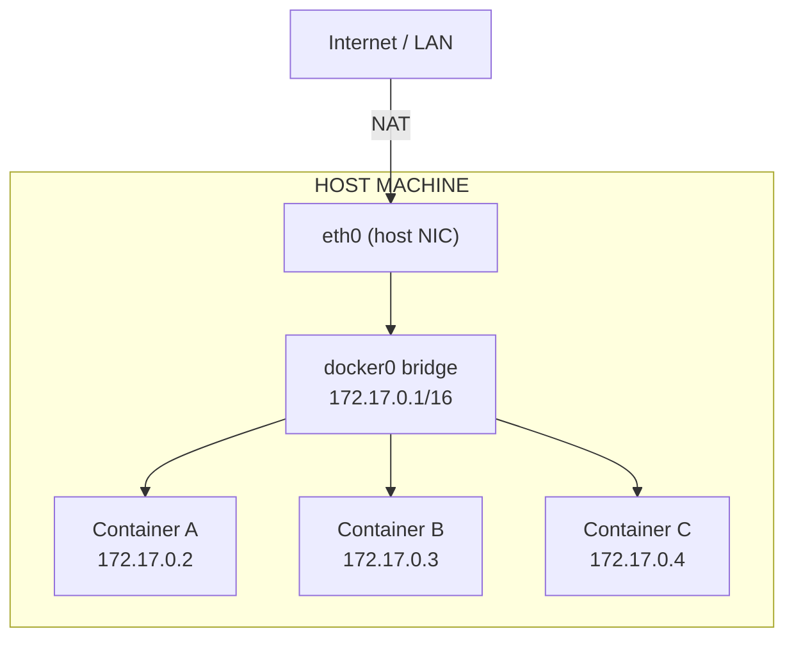
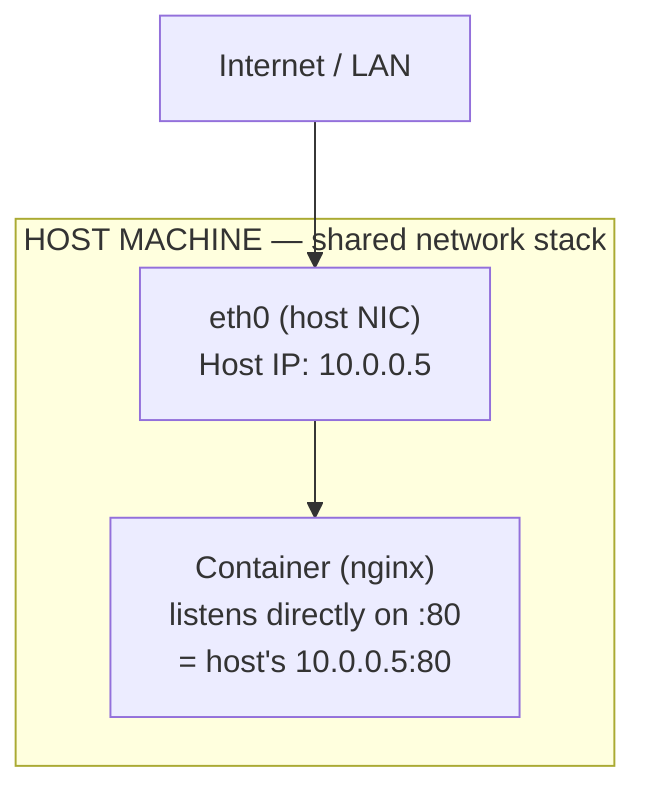
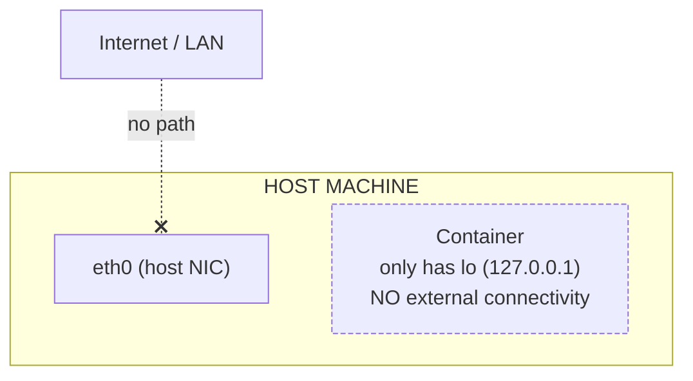
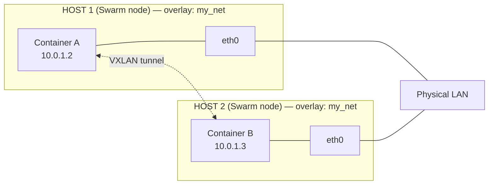
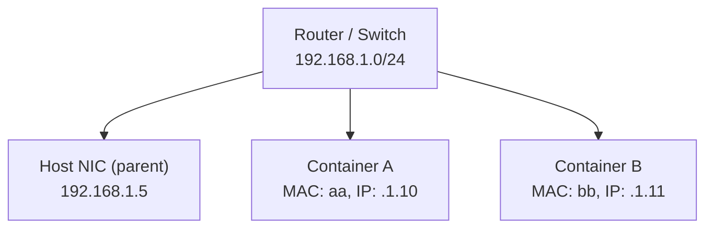
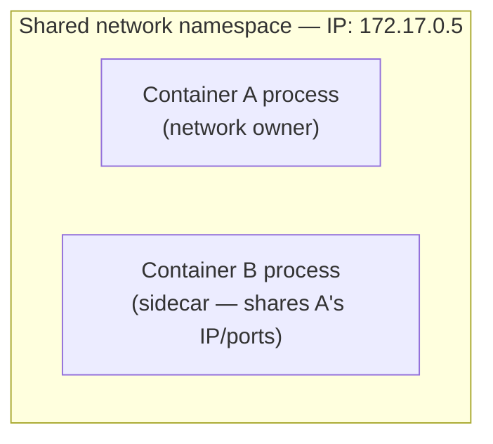

# Docker Networking — Types, How They Work, and How to Use Them

Docker ships with several built-in network drivers. Each one controls how containers talk to each other, to the host, and to the outside world.

```
docker network ls          # list all networks
docker network inspect X   # see details of a network
docker network create X    # create a new network
docker network rm X        # remove a network
```

| Driver | Scope | Typical use case |
|---|---|---|
| `bridge` | Single host | Default — most standalone containers |
| `host` | Single host | Max network performance, no isolation |
| `none` | Single host | Full network isolation |
| `overlay` | Multi-host (Swarm) | Containers across multiple Docker hosts |
| `macvlan` | Single host | Container needs its own MAC/IP on the physical LAN |
| `ipvlan` | Single host | Like macvlan but shares the host's MAC address |
| `container` (mode) | Single host | Share another container's network stack |

---

## 1. Bridge Network (default)

### How it works
Docker creates a private internal network (`docker0` by default) on the host. Every container attached to a bridge network gets its own internal IP and can talk to other containers on the *same* bridge. Traffic to/from the outside world is NATed through the host.



- Default bridge (`bridge`) network: containers can reach each other only by IP (no automatic DNS).
- **User-defined bridge** (recommended): containers can resolve each other **by container name** via Docker's embedded DNS.

### Create it
```bash
docker network create --driver bridge my_bridge_net

# with a custom subnet/gateway
docker network create --driver bridge \
  --subnet 172.20.0.0/16 \
  --gateway 172.20.0.1 \
  my_bridge_net
```

### Use it
```bash
docker run -d --name web --network my_bridge_net nginx
docker run -d --name app --network my_bridge_net myapp

# 'app' can reach 'web' by name:
#   curl http://web
```

**Used for:** the default choice for standalone containers on a single host — e.g., an app container talking to a database container, both on the same custom bridge, resolving each other by name.

---

## 2. Host Network

### How it works
The container shares the host's network stack directly — no NAT, no separate IP. A container's `EXPOSE 80` becomes the host's port 80 with zero translation.



### Create / use it
No separate network object to create — `host` is a built-in mode you select at run time:

```bash
docker run -d --network host nginx
# nginx is now reachable at http://<host-ip>:80 directly
```

**Used for:** performance-sensitive workloads that want to avoid NAT overhead (e.g., high-throughput proxies, monitoring agents that need to see host-level network stats). Trade-off: no port isolation — a container can bind any host port, and two containers using `host` mode can collide on the same port.

> Note: `host` networking only works on Linux hosts (not Docker Desktop on Mac/Windows).

---

## 3. None Network

### How it works
The container gets its own network namespace but **no interfaces** are configured (aside from loopback). It's completely isolated from other containers and the outside world.



### Create / use it
Also a built-in mode, not something you `create`:

```bash
docker run -d --network none my_isolated_job
```

**Used for:** batch/CLI jobs that must never touch the network (security sandboxing, offline data processing), or as a base before manually attaching custom interfaces yourself.

---

## 4. Overlay Network

### How it works
Overlay networks span **multiple Docker hosts** (a Swarm cluster). Docker builds a virtual network on top of the hosts' physical network using VXLAN encapsulation, so containers on different physical machines can talk to each other as if they were on the same LAN.



### Create it
Requires Swarm mode to be initialized first:

```bash
docker swarm init                      # only on the manager node
docker network create --driver overlay my_overlay_net

# to also allow standalone (non-swarm-service) containers to attach:
docker network create --driver overlay --attachable my_overlay_net
```

### Use it
```bash
docker service create --name web --network my_overlay_net --replicas 3 nginx
```

**Used for:** multi-host container communication in a Swarm cluster — e.g., a microservices stack where the API service (on host 1) and the database service (on host 2) need to talk to each other transparently.

---

## 5. Macvlan Network

### How it works
Gives each container its **own MAC address and IP address** on the physical network, making it appear as a real, independent device on the LAN — as if it were plugged directly into the switch. Bypasses the Docker bridge/NAT entirely.


*Each container appears as its own physical device on the LAN, separate from the host NIC.*

### Create it
```bash
docker network create --driver macvlan \
  --subnet 192.168.1.0/24 \
  --gateway 192.168.1.1 \
  -o parent=eth0 \
  my_macvlan_net
```

### Use it
```bash
docker run -d --name legacy_app --network my_macvlan_net --ip 192.168.1.10 my_image
```

**Used for:** legacy apps that expect to own a real network interface/IP on the LAN, or network appliances/monitoring tools that need to be directly visible to other devices on the network (not behind NAT).

> Caveat: most cloud provider VMs/NICs block macvlan by default (promiscuous mode restrictions) — it's mainly a bare-metal / on-prem technique.

---

## 6. Container Network Mode (shared namespace)

### How it works
A container reuses **another container's** network namespace entirely — same IP, same interfaces, same open ports. They effectively share one network identity.



### Create / use it
Not a driver you create — you point one container at another's namespace:

```bash
docker run -d --name main_app my_image
docker run -d --network container:main_app --name sidecar my_sidecar_image
# sidecar shares main_app's IP and ports (localhost between them)
```

**Used for:** sidecar patterns — e.g., a logging/metrics agent that needs to see the exact same network view (and `localhost`) as the main application container.

---

## Choosing the Right Network — Cheat Sheet

| Need | Use |
|---|---|
| Containers on one host, talk by name, isolated from host | `bridge` (user-defined) |
| Max performance, no isolation needed | `host` |
| Total network isolation for a job | `none` |
| Containers across multiple hosts (Swarm) | `overlay` |
| Container needs a real LAN IP/MAC | `macvlan` |
| Sidecar sharing another container's network | `container:<name>` |

## Key Takeaways

- **Always prefer user-defined bridge networks** over the default `bridge` — you get automatic DNS-based service discovery by container name.
- **`host` and `none`** are built-in modes selected with `--network host` / `--network none` — you don't `docker network create` them.
- **`overlay`** is the only driver that works across multiple physical/virtual hosts, and requires Swarm mode.
- **`macvlan`** is the closest thing to "this container is a real device on my LAN," but often doesn't work on cloud VMs due to NIC restrictions.
- Inspect any network's connected containers, subnet, and gateway with `docker network inspect <name>`.
