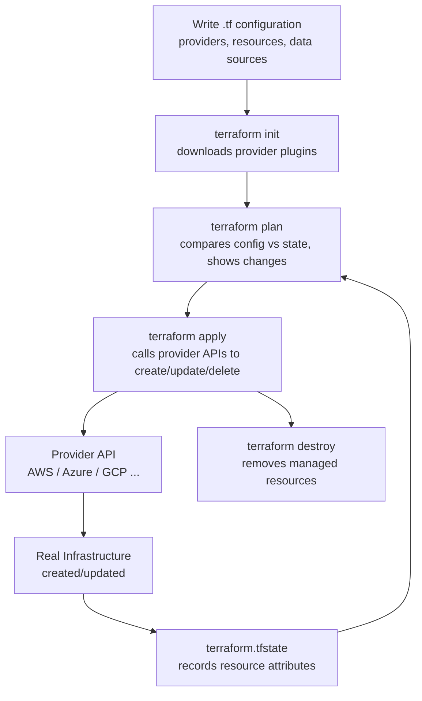

# Terraform Core Concepts

## 1. Providers

A **provider** is a plugin that lets Terraform talk to a specific platform's API (AWS, Azure, GCP, GitHub, Kubernetes, etc.). It translates your `.tf` configuration into actual API calls.

```hcl
provider "aws" {
  region = "ap-south-1"
}
```

## 2. Resource

A **resource** is a piece of infrastructure Terraform creates, manages, and can destroy — e.g., an EC2 instance, an S3 bucket, a VPC.

```hcl
resource "aws_instance" "web" {
  ami           = "ami-0abcd1234"
  instance_type = "t2.micro"
}
```

## 3. Data Source

A **data source** lets Terraform *read* existing information (not create it) — e.g., look up an existing AMI ID, VPC, or subnet already present in the account.

```hcl
data "aws_ami" "ubuntu" {
  most_recent = true
  owners      = ["099720109477"]
}
```

## 4. Argument

An **argument** is an input you set inside a resource or data block — it configures how the resource should be created.

```hcl
resource "aws_instance" "web" {
  ami           = "ami-0abcd1234"   # <- argument
  instance_type = "t2.micro"        # <- argument
}
```

## 5. Attribute

An **attribute** is a value Terraform gets back *after* the resource is created — often generated by the provider (like an instance's ID or public IP), and can be referenced elsewhere.

```hcl
output "instance_ip" {
  value = aws_instance.web.public_ip   # <- attribute
}
```

## Argument vs Attribute — Quick Comparison

| | Argument | Attribute |
|---|---|---|
| Direction | You → Terraform (input) | Terraform → You (output) |
| When known | Before creation (you define it) | After creation (provider returns it) |
| Example | `instance_type = "t2.micro"` | `aws_instance.web.public_ip` |

## How Terraform Works — Flow Diagram



**Flow explanation:**

1. **Write configuration** — define providers, resources, data sources, and arguments in `.tf` files.
2. **`terraform init`** — downloads the required provider plugins.
3. **`terraform plan`** — compares your configuration against the current state file and shows what will be created, changed, or destroyed.
4. **`terraform apply`** — sends the actual API calls to the provider to make the real-world infrastructure match your configuration.
5. **State file (`terraform.tfstate`)** — Terraform records the resulting attributes (IDs, IPs, ARNs, etc.) so future plans know the current state.
6. **`terraform destroy`** — reads the state file and removes everything Terraform created.

---
