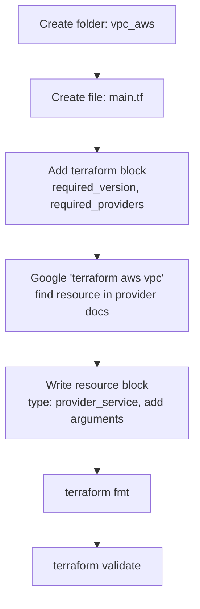

### Scenario 1: Creating a network with subnets in AWS

- To write terraform templates we need to understand HCL (Hashicorp configuration language)

- [Datatypes](https://developer.hashicorp.com/terraform/language/expressions/types)
  - string
  - number
  - boolean
  - list
  - set
  - object/map

#### Datatype use cases

| Datatype | Use Case |
|---|---|
| **string** | Text values — resource names, regions, AMI IDs, CIDR blocks (e.g. `"ap-south-1"`, `"10.0.0.0/16"`) |
| **number** | Numeric values — port numbers, instance counts, disk size in GB (e.g. `count = 3`, `port = 8080`) |
| **boolean** | True/false toggles — enabling or disabling a feature (e.g. `enable_dns_support = true`, `associate_public_ip_address = false`) |
| **list** | An ordered collection of values of the same type — multiple subnet CIDRs, multiple AZs (e.g. `["10.0.1.0/24", "10.0.2.0/24"]`) |
| **set** | Like a list, but unordered and with no duplicate values — useful when order doesn't matter, e.g. a set of security group IDs |
| **object/map** | Key-value pairs — grouping related settings together, e.g. tags (`{ Name = "vpc-main", Env = "dev" }`) or a map of subnet name to CIDR |

### Working with terraform

- we will be following [google style guide for terraform](https://docs.cloud.google.com/docs/terraform/best-practices/general-style-structure)

- create a new folder `vpc_aws`

- Create a new file `main.tf`

- [Terraform block](https://developer.hashicorp.com/terraform/language/block/terraform): using this block we can restrict
  - which version of terraform is required to run this template
  - which version of providers needs to be used

- For version restrictions we have expression in terraform `version constraint syntax`

- After writing template try to format
  - terraform fmt
  - If terraform extension in vscode is installed, you can use format

- We need to create vpc resource, to find any resource
  - google `terraform <provider> <resource>` => `terraform aws vpc`

  

  - Use provider docs (watch classroom recording)
  - [Terraform resource block](https://developer.hashicorp.com/terraform/language/block/resource)
  - Type => `<provider>_<service|functionality>`
  - For every resource we can pass arguments, not all arguments are required
  - Now lets fmt and then validate

  

#### `terraform fmt` vs `terraform validate`

| Command | Purpose |
|---|---|
| **`terraform fmt`** | Rewrites `.tf` files into the standard style — consistent indentation, spacing, and alignment. It does **not** check correctness, only formatting. Safe to run anytime; makes diffs and code reviews cleaner. |
| **`terraform validate`** | Checks the configuration for internal consistency — correct syntax, valid argument names, correct types, and that required arguments aren't missing. It does **not** check against real cloud resources or credentials, only the configuration itself. |

**Typical order:** write config → `terraform fmt` (clean up style) → `terraform validate` (catch syntax/config errors) → `terraform plan` (preview real changes).

- [Refer Here](https://github.com/asquarezone/NewTerraformZone/commit/f0a0ca844b19c125b519e2b37db13a9595288793) for the changes done

## Workflow — Flow Diagram

---
