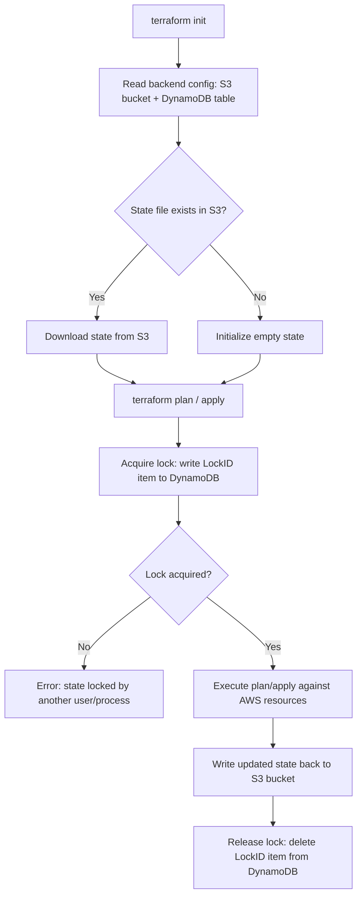
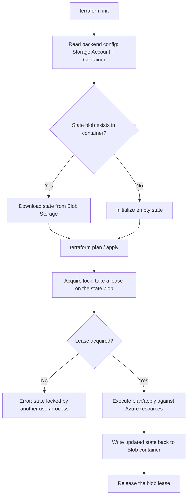
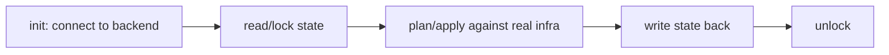

# Terraform Backend — AWS and Azure

## What is a Terraform Backend

A backend determines **where Terraform stores its state file** (`terraform.tfstate`) and **how operations like `plan`/`apply` are executed**. Every Terraform configuration has a backend, whether declared explicitly or not.

Two categories:

- **Local backend** (default) — state file is stored on disk at `terraform.tfstate` in the working directory. Fine for solo, throwaway work.
- **Remote backend** — state is stored in a shared, external location (S3, Azure Blob, Terraform Cloud, GCS, etc.).

## Why Use a Remote Backend

| Problem with local state | What remote backend solves |
|---|---|
| Only one person has the state file | Centralized state, accessible to the whole team |
| Two people run `apply` at the same time → state corruption | **State locking** — prevents concurrent writes |
| State stored in plain text on a laptop | Encryption at rest, access control (IAM/RBAC) |
| No history if the file is lost | Versioning (e.g., S3 versioning) |

## AWS Backend: S3 + DynamoDB

| Component | Role |
|---|---|
| **S3 bucket** | Stores the actual `terraform.tfstate` file |
| **DynamoDB table** | Provides state locking via a `LockID` item (and optional state consistency checking) |

**Backend block:**

```hcl
terraform {
  backend "s3" {
    bucket         = "my-tfstate-bucket"
    key            = "envs/prod/terraform.tfstate"
    region         = "us-east-1"
    dynamodb_table = "terraform-locks"
    encrypt        = true
  }
}
```

### AWS Backend Flow



> Note: Newer AWS provider versions support native S3 locking (via S3 conditional writes) without a separate DynamoDB table, but the S3 + DynamoDB pattern is still the most common and the one usually taught.

## Azure Backend: Storage Account + Blob Container

| Component | Role |
|---|---|
| **Storage Account** | Hosts the blob container |
| **Blob Container** | Stores the `terraform.tfstate` blob |
| **Blob lease** | Azure's native locking mechanism — no separate lock table needed |

**Backend block:**

```hcl
terraform {
  backend "azurerm" {
    resource_group_name  = "tfstate-rg"
    storage_account_name = "tfstateaccount01"
    container_name        = "tfstate"
    key                   = "prod.terraform.tfstate"
  }
}
```

### Azure Backend Flow




### Regardless of provider, the backend lifecycle is the same shape:


