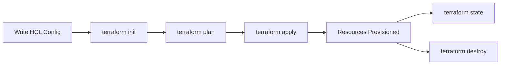

# Terraform Overview — Key Concepts & Real-Time Tasks

## 1. Terraform

Terraform is an **Infrastructure as Code (IaC)** tool by HashiCorp used to define, provision, and manage infrastructure across cloud providers (AWS, Azure, GCP, etc.) using a declarative configuration language called **HCL (HashiCorp Configuration Language)**.

- **Declarative**: You describe the desired end state; Terraform figures out how to get there.
- **Provider-agnostic**: Same workflow across AWS, Azure, GCP, on-prem, SaaS.
- **State-driven**: Terraform tracks real-world resources in a state file to know what exists and what needs to change.

---

## 2. Terraform Workflow



| Command | Purpose |
|---|---|
| `terraform init` | Initializes working directory, downloads providers/modules, configures backend |
| `terraform fmt` | Formats `.tf` files to canonical style |
| `terraform validate` | Checks configuration syntax and internal consistency |
| `terraform plan` | Shows execution plan — what will be created/changed/destroyed |
| `terraform apply` | Applies the plan and provisions/updates real infrastructure |
| `terraform destroy` | Tears down all resources managed by the configuration |
| `terraform state` | Inspect/modify the state file (list, show, mv, rm) |
| `terraform import` | Brings existing infrastructure under Terraform management |
| `terraform taint` / `-replace` | Forces a resource to be destroyed and recreated on next apply |
| `terraform output` | Displays output values |
| `terraform workspace` | Manages multiple state environments within one configuration |

---

## 3. Key Concepts

### 3.1 Providers
Plugins that let Terraform interact with an API (AWS, Azure, GCP, Kubernetes, etc.).

```hcl
provider "aws" {
  region = "us-east-1"
}
```

### 3.2 Resources
The fundamental building block — describes an infrastructure object to be created and managed.

```hcl
resource "aws_instance" "web" {
  ami           = "ami-0abcdef1234567890"
  instance_type = "t2.micro"
}
```

### 3.3 Data Sources
Fetch read-only information from a provider (existing infra not managed by this config).

```hcl
data "aws_ami" "latest_amazon_linux" {
  most_recent = true
  owners      = ["amazon"]
}
```

### 3.4 Arguments & Attributes
- **Arguments**: Inputs you set inside a resource/data block (e.g., `ami`, `instance_type`).
- **Attributes**: Values exported by a resource after creation, referenced as `resource_type.name.attribute` (e.g., `aws_instance.web.public_ip`).

### 3.5 Variables
Parameterize configuration for reusability.

```hcl
variable "instance_type" {
  type    = string
  default = "t2.micro"
}
```
Assigned via `.tfvars` files, CLI flags (`-var`), environment variables (`TF_VAR_name`), or defaults.

### 3.6 Outputs
Expose values after apply — useful for chaining modules or displaying key info.

```hcl
output "instance_ip" {
  value = aws_instance.web.public_ip
}
```

### 3.7 State
Terraform maintains a JSON file (`terraform.tfstate`) mapping configuration to real-world resource IDs. It's the source of truth for diffing during `plan`.

- **Local state**: Stored on disk — fine for individual/learning use.
- **Remote state**: Stored in a shared backend (S3, Azure Storage, Terraform Cloud) — required for team collaboration.
- **State locking**: Prevents concurrent modifications (e.g., DynamoDB for AWS, blob leases for Azure).

### 3.8 Backend
Defines where state is stored.

```hcl
terraform {
  backend "s3" {
    bucket         = "my-tf-state-bucket"
    key            = "prod/network/terraform.tfstate"
    region         = "us-east-1"
    dynamodb_table = "tf-lock-table"
  }
}
```

### 3.9 Modules
Reusable, self-contained packages of Terraform configuration.

- **Root module**: The main working directory.
- **Child module**: Called from root (or another module) via a `module` block.

```hcl
module "vpc" {
  source     = "./modules/vpc"
  cidr_block = "10.0.0.0/16"
}
```
Sources can be local paths, the Terraform Registry, Git repos, or S3.

### 3.10 Provisioners
Execute scripts/commands on a resource during creation or destruction (`local-exec`, `remote-exec`). Considered a last resort — prefer native provider features or config management tools (Ansible) where possible.

### 3.11 Meta-Arguments
- `count` — create multiple instances of a resource from a single block.
- `for_each` — create multiple instances keyed by a map/set (preferred over `count` when items need stable identity).
- `depends_on` — explicit dependency when Terraform can't infer it.
- `lifecycle` — controls behavior (`create_before_destroy`, `prevent_destroy`, `ignore_changes`).

### 3.12 Expressions & Functions
- **Interpolation**: `"${var.name}"` (implicit in modern HCL for most cases).
- **Conditional expressions**: `var.env == "prod" ? "m5.large" : "t2.micro"`
- **Built-in functions**: `length()`, `lookup()`, `merge()`, `join()`, `split()`, `file()`, `templatefile()`, `jsonencode()`, `cidrsubnet()`, etc.

### 3.13 Workspaces
Allow multiple state files (e.g., dev/staging/prod) from the same configuration.

```bash
terraform workspace new dev
terraform workspace select dev
```

### 3.14 Terraform Datatypes
- **Primitive**: `string`, `number`, `bool`
- **Collection**: `list`, `map`, `set`
- **Structural**: `object`, `tuple`

---

## 4. Real-Time Tasks (Hands-On Scenarios)

### Task 1 — Provision a VPC with Public/Private Subnets
1. Define `aws_vpc`, `aws_subnet` (public + private), `aws_internet_gateway`, `aws_nat_gateway`, and route tables.
2. Use `count` or `for_each` to loop across multiple Availability Zones.
3. Run `terraform plan` to review the subnet CIDR allocation before apply.

### Task 2 — Launch an EC2 Instance with a Dynamic AMI
1. Use a `data "aws_ami"` block to always fetch the latest Amazon Linux AMI instead of hardcoding.
2. Pass `instance_type` as a variable with environment-specific `.tfvars` files (`dev.tfvars`, `prod.tfvars`).
3. Apply with `terraform apply -var-file="dev.tfvars"`.

### Task 3 — Configure Remote State with Locking
1. Create an S3 bucket (versioning enabled) and a DynamoDB table with a `LockID` primary key.
2. Add the `backend "s3"` block and run `terraform init` to migrate local state to remote.
3. Verify locking by running `apply` from two terminals — the second should wait/fail on the lock.

### Task 4 — Build and Consume a Reusable Module
1. Create a `modules/ec2-instance` directory with its own `variables.tf`, `main.tf`, `outputs.tf`.
2. Call it from root with different variable values for multiple environments.
3. Version-pin a public registry module, e.g., `source = "terraform-aws-modules/vpc/aws"`, `version = "~> 5.0"`.

### Task 5 — Manage Multiple Environments with Workspaces
1. `terraform workspace new dev` / `staging` / `prod`.
2. Reference `terraform.workspace` inside config to adjust naming or sizing per environment.
3. Confirm each workspace has its own isolated state via `terraform workspace list` and `terraform state list`.

### Task 6 — Import Existing (Manually Created) Infrastructure
1. Write a resource block matching an existing AWS resource (e.g., an S3 bucket created via console).
2. Run `terraform import aws_s3_bucket.existing my-existing-bucket-name`.
3. Run `terraform plan` and reconcile any drift shown between actual config and imported state.

### Task 7 — Handle Configuration Drift
1. Manually change a resource attribute in the cloud console (e.g., resize an EC2 instance).
2. Run `terraform plan` — Terraform detects the drift and shows the corrective diff.
3. Decide: `apply` to revert to code-defined state, or update code + `ignore_changes` if the manual change should persist.

### Task 8 — Zero-Downtime Resource Replacement
1. Add `lifecycle { create_before_destroy = true }` to a resource such as a launch template or AMI-based instance.
2. Change an immutable attribute (e.g., AMI ID) and apply — Terraform creates the new resource before destroying the old one.

### Task 9 — Secure Secrets in Terraform
1. Avoid hardcoding credentials/secrets in `.tf` or `.tfvars` files.
2. Use environment variables (`TF_VAR_db_password`), a secrets manager (AWS Secrets Manager/SSM Parameter Store, Azure Key Vault) via `data` sources, or a `.tfvars` file excluded via `.gitignore`.
3. Mark sensitive variables/outputs with `sensitive = true` to suppress CLI/log exposure.

### Task 10 — CI/CD Integration (GitHub Actions Example)
1. On pull request: run `terraform fmt -check`, `terraform validate`, and `terraform plan`, posting the plan as a PR comment.
2. On merge to main: run `terraform apply -auto-approve` using a remote backend and least-privilege CI credentials.
3. Store state remotely so the pipeline and local developers always see the same state.

### Task 11 — Refactor State Without Destroying Resources
1. Renamed a resource or moved it into a module in code.
2. Use `terraform state mv <old_address> <new_address>` (or `moved` blocks in newer Terraform versions) so Terraform doesn't destroy/recreate the resource.
3. Confirm with `terraform plan` — expect "no changes."

### Task 12 — Multi-Cloud Setup (AWS + Azure in One Config)
1. Declare both `provider "aws"` and `provider "azurerm"` blocks.
2. Provision a VPC/VNet pair and a VPN or peering connection between them.
3. Use `output` blocks to pass connection details (like gateway IPs) between the two provider resource sets.

---
